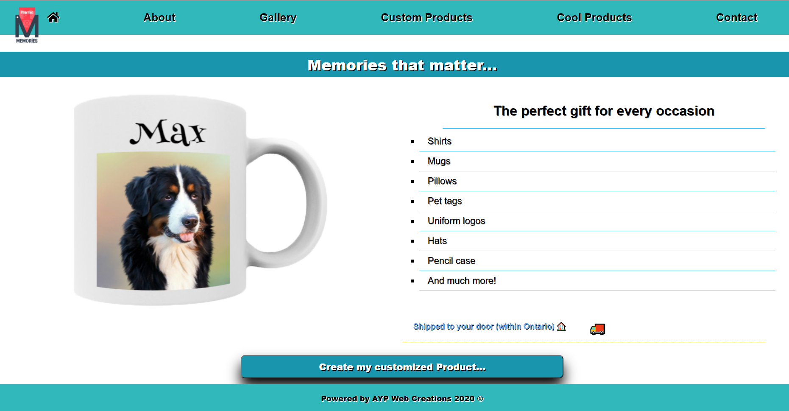

# Printing Memories

This project can be found live at https://www.printingmemories.ca/

## Description

This project is a real e-commerce application where users have the option to create, design, and customize a number of products before they can add them to the shopping cart. All the products come from the database, so the information/description is dynamically showed to the users. The products in the shopping cart are stored in a central store (REDUX), where the data persists (using redux-persist) even if the browser is refreshed or closed/open.
Once the user add all the items, customized or general, they proceed to the checkout section where they enter the payment information and after making a successful payment, they will receive an email with all the details of their purchase and instructions on how pick up their order or when it will be delivered. The Website administrator will also receive an email with the order placed and screenshots of the products created by the customers.

## Tools/technologies used

### Front End

- React
- Css
- SASS
- Html
- Javascript
- Redux
- Mailgun
- Stripe Elements

### Back End

- Node
- Express
- Mongo DB (Mongo Atlas)
- Nodemailer
- Stripe (For processing payments)

## Deployment

Heroku
